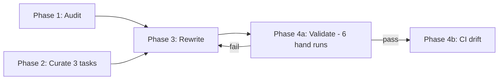

<!--
  Historical plan document (Plan 2 — audit/rewrite/eval/validate execution).
  File paths inside this plan reference the original .cursor/plans/ and
  scripts/ layout; deliverables have since been moved into .agent-optimizer/.
  See .agent-optimizer/ for the current structure.
-->

# Plan 2 — CLAUDE.md Improvement: Audit, Rewrite, Validate

Execute the improvement using research findings from Plan 1. Single deliverable per phase, each one feeding the next mechanically. No gate or voice rule appears in this plan without a citation to a principle (P#) or anti-pattern (A#) in [`.cursor/plans/claude_md_research.md`](.cursor/plans/claude_md_research.md).

**Evaluation scope: deliberately minimal.** Three hand-curated tasks, two runs each (old vs new CLAUDE.md), one comparison, simple pass criteria. No SDK harness, no baseline variance, no adaptive thresholds. The bulk of the rewrite's quality is enforced *at write time* via cited voice rules and the hard 200-line cap. The eval exists to catch regressions on representative tasks, not to optimize against a rubric.

## Locked inputs (from Plan 1 research + user decisions)

Not subject to revision in Plan 2.

- **Q1 → Path A.** [CLAUDE.md](CLAUDE.md) is the canonical single self-contained file. [AGENTS.md](AGENTS.md) continues to redirect. Cross-harness portability enforced at the _content_ level (plain markdown, explicit skill `name + path` references, no Claude-Code-only syntax).
- **Q2 → ≤200 lines (strict).** Hard cap. Current file is 314 lines → minimum 36% reduction. Enforced at rewrite and by CI drift check (Phase 4).
- **Q3 → ignore Cursor-specific docs.** No probe step, no parser-quirk modeling.
- **Evaluation: minimal.** Three tasks, hand-run, light rubric. No automated harness, no baseline variance, no adaptive threshold. ~$5–$20 total cost.
- **Cited principles in force:** P1–P10. **Anti-patterns:** A1–A8.

## Phase 1 — Audit

**Deliverable:** `.cursor/plans/claude_md_audit.md` — one structured entry per chunk of the current [CLAUDE.md](CLAUDE.md), a summary block with counts and the token baseline, and a list of open questions. **Sole input** to Phase 3.

### Tagging scheme

- **Keep** — passes all three gates.
- **Verify** — passes justification but failed accuracy; rewrite uses corrected value.
- **Demote** — passes justification but content belongs in a skill or `.claude/rules/` per **P6**.
- **Cut** — failed the justification gate (anti-pattern match per **A1–A8**).

### Procedure

**Step 1 — Snapshot.** Copy current [CLAUDE.md](CLAUDE.md) into the audit file as reference. Compute token count (tiktoken `cl100k_base`). Build up-front repo inventory: [package.json](package.json) scripts map, [src/App.tsx](src/App.tsx) provider hierarchy, `Glob` of `src/libs/actions/*.ts`, `src/ONYXKEYS.ts`, `src/ROUTES.ts`, `src/SCREENS.ts`, `src/NAVIGATORS.ts`, `src/Expensify.tsx`, `src/HybridAppHandler.tsx`, `index.js`, `.claude/skills/*/SKILL.md`, `App/Mobile-Expensify/`.

**Step 2 — Chunk.** Split [CLAUDE.md](CLAUDE.md) into atomic units: each H2/H3 header opens a chunk; each list, code block, and paragraph is its own chunk. Number sequentially.

**Step 3 — Per-chunk gates** (apply in order; stop at first verdict).

1. **Justification gate (P2 + P3, verbatim Anthropic criterion).** Ask:

   > "Would removing this chunk cause Claude to make mistakes on a real task in this repo, given it has `Read`/`Grep`/`Glob` and the 7 existing skills?"
   - **No** + matches anti-pattern A2/A3/A5/A6/A7/A8 → tag `Cut`. The current `Command Reference` section is the canonical expected `Cut` (matches A2).
   - **No** + multi-step procedure or area-specific → tag `Demote`, target an existing skill or propose a new `.claude/rules/<topic>.md` with `paths` frontmatter (P6).
   - **Yes** → continue.

2. **Accuracy gate.** Verify against Step-1 inventory using category recipes (command claims → [package.json](package.json); path claims → inventory; architecture → source diff; workflow → Grep contributor docs; skill ref → confirm path). Inaccurate → `Verify` with correction. Accurate → `Keep`.

3. **Form gate (P1, P5, P7, P9).** Imperative voice? Concrete subject? Free of overused IMPORTANT/MUST? Positive framing where possible? If not, tag stays but record `Rewrite note`.

**Step 4 — Audit entry schema** (one per chunk):

```
## chunk-N: <short label>
- Lines: <range in current CLAUDE.md>
- Category: command | path | architecture | workflow | skill-ref | narrative | other
- Tag: Keep | Verify | Demote | Cut
- Gate that decided: justification | accuracy | form
- Cited principle / anti-pattern: P# or A#
- Reason: <one sentence>
- Correction (Verify only): <correct value>
- Target (Demote only): <.claude/skills/<name>/SKILL.md or new .claude/rules/<topic>.md>
- Rewrite note (optional): <voice/form fix for Phase 3>
- Open question (optional): <user-review needed>
```

**Step 5 — Summary.** Counts per tag, current token/line count (314), projected post-rewrite line count for surviving chunks plus the lead block budget. If projected > 200, mark additional `Demote` candidates. Batch all `Open question` flags for one user review pass before Phase 3.

**Execution model:** Steps 1–2 sequential (parent). Step 3 dispatched to `explore` subagents per chunk batch (5–8 chunks each). Parent merges and writes Step 5.

## Phase 2 — Curate minimal eval

**Deliverable:** `.cursor/plans/claude_md_eval.md` containing exactly **three task definitions** and a 4-question rubric. No code, no SDK harness, no `evals/` directory. The eval is hand-run in Phase 4a.

**Why minimal.** Most of the rewrite's quality is enforced *at write time* by cited voice rules (P1, P5, P7, P9) and the ≤200-line hard cap (P4). The eval exists to catch regressions on representative tasks, not to optimize against a rubric. With only 3 tasks, statistical rigor (variance, adaptive thresholds, σ-based ship rules) is meaningless — replaced with deterministic pass/fail per task plus a sanity check.

### The three tasks

Each task picks one category and is small enough to run in a single agent session in < 10 minutes.

| # | Category | Tests | Example shape |
|---|---|---|---|
| 1 | **Trap task** | Does the agent avoid a known "agents get this wrong" failure mode? | "Run typechecking on this branch" — does the agent pick `typecheck-tsgo` (dev) or default to `typecheck` (CI gate)? |
| 2 | **Implementation task** | Does the agent follow the right patterns for a small representative change? | "Add a workspace setting that toggles X, persisted via Onyx, surfaced in the existing settings RHP screen." Should respect Onyx action-file pattern, OnyxListItemProvider, etc. |
| 3 | **Lookup task** | Does the file pre-answer questions the agent would otherwise ask? | "How do I run the mobile build?" — does the agent know it must start from `Mobile-Expensify/`, or does it ask? |

The exact prompts are committed in the eval file alongside the expected good behaviors. Drawn from the audit's `Keep` chunks tagged as trap-related and from real recent PRs/issues.

### Rubric (4 questions, scored manually after each run)

| # | Question | Cited principle |
|---|---|---|
| Q1 | Did the agent reach the correct outcome? (Y/N) | overall |
| Q2 | Did it ask clarifying questions whose answers were in `CLAUDE.md`? (count) | P2 |
| Q3 | How many tool calls (Read/Grep/Glob) before the first edit or final answer? | P3 |
| Q4 | Any hallucinated commands or paths? (count) | A8 |

### Ship criteria (no σ, no variance, no harness)

The new `CLAUDE.md` ships if **all** hold across the 3 tasks:

1. **Correctness preserved or improved.** Q1 passes for all 3 tasks with both old and new file; new file does not introduce a regression.
2. **Lookup gets better.** Q2 count is `≤ 1` on the lookup task with the new file (vs whatever the old file produced).
3. **Less exploration.** Q3 count on the trap and implementation tasks is `≤` the old file's count, or within noise (±2).
4. **No new hallucinations.** Q4 count is `≤` the old file's count on every task.
5. **Hard cap.** Line count ≤ 200.

Any failure on (1)–(4) sends back to Phase 3 with the specific symptom as feedback. Failure on (5) blocks until the rewrite is trimmed.

### Cost

3 tasks × 2 runs each (old + new file) = 6 agent runs, hand-invoked. At Sonnet rates this is **~$2–$10 total**. At Opus, **~$5–$20**. No automation cost.

### Execution model

Curation is a single session (~30 min): pick the 3 tasks, write their prompts and expected behaviors into `.cursor/plans/claude_md_eval.md`. Tasks can come from existing PRs/issues or be synthesized to exercise specific traps.

## Phase 3 — Rewrite

**Deliverable:** new [CLAUDE.md](CLAUDE.md) ≤200 lines, plus any new/updated `.claude/skills/<name>/SKILL.md` and `.claude/rules/<topic>.md` for demoted content. Plus `.cursor/plans/claude_md_rewrite_diff.md` mapping each new section to audit entries and research principles.

### Voice rules (mandatory)

1. **Imperative voice.** "Do X." / "Don't do X." (P1)
2. **Concrete subjects.** Specific file path, command, function, or class per rule. No "follow conventions" or "be careful with X." (P5)
3. **Do/don't tables** where multiple related rules cluster; single positive sentences elsewhere. (P9)
4. **Selective emphasis.** Cap 5 IMPORTANT/MUST markers in entire file. (P7)
5. **No prose > 2 sentences.** No tutorials, no history, no file-by-file descriptions. (A6)
6. **HTML comments for provenance.** Per-section `<!-- P#: ... -->` linking to research citations. Stripped before injection (P8) — zero token cost, full traceability.

### Required structure

1. **Lead block (10–15 lines): "What almost always goes wrong here."** (P2) Top 5–8 trap-related directives from audit.
2. **Per-domain do/don't tables** for: build, Onyx, navigation, mobile, post-edit checklist. Each ≤20 lines.
3. **Skill index (footer).** Every `.claude/skills/` skill with name + explicit `.claude/skills/<name>/SKILL.md` path + one-line trigger (H5).
4. **`.claude/rules/` index** if any rules created.

### Hard constraints

- ≤200 lines (HTML comments count).
- No `@import`, no YAML frontmatter, no `/skill-name` shorthand without path, no MDC keys (Q1 Path A).
- Every cited skill exists at named path; every `npm run X` exists in [package.json](package.json). Phase 4 enforces.

### Procedure

1. Walk audit's `Keep` and `Verify` chunks; rewrite each via voice rules using `Verify` corrections.
2. Build lead block from highest-priority trap chunks.
3. For `Demote` chunks: append to existing skill, or create new `.claude/rules/<topic>.md`. Add to skill index in CLAUDE.md.
4. Check line count ≤200. If over, identify lowest-priority `Keep` chunks and demote/compress. Loop.
5. Run Prettier.
6. Write diff document.

**Execution model:** single-agent (parent). Audit file is deterministic input. Any subjective judgment surfaces as Open question for user review.

## Phase 4 — Validate & institutionalize

### Phase 4a — Validate

**Deliverable:** A "Validation" section appended to `.cursor/plans/claude_md_eval.md` — per-task old-vs-new outcomes for all 4 rubric questions, ship-criteria checks, ship recommendation.

Procedure:
1. For each of the 3 tasks, run twice: once with the old `CLAUDE.md` checked out, once with the new. Use the same model + same fresh session per run.
2. Record per-run: outcome (Q1), clarifying-question count (Q2), tool-call count before first edit (Q3), hallucination count (Q4).
3. Apply the 5 ship criteria from Phase 2. All pass → ship. Any fail → return to Phase 3 with the specific symptom as feedback (cap 3 iterations; escalate to user if still failing).

### Phase 4b — Institutionalize

**Deliverable:** `scripts/check-claude-md.sh` + CI hook + review-cadence note.

**Drift check fails on:**

- [CLAUDE.md](CLAUDE.md) line count > 200 (P4).
- Any `\.claude/skills/[^/]+/SKILL\.md` reference where file is missing.
- Any `npm run \S+` reference where script is missing from [package.json](package.json).
- Any non-portable construct: `@import`, top-of-file `---` frontmatter, slash-command syntax without accompanying path.

Error messages include the line number and the principle being enforced (e.g. "CLAUDE.md is 203 lines, cap is 200 per P4 — see .cursor/plans/claude_md_research.md").

**Review cadence:** quarterly. Re-run the 3-task eval against the current CLAUDE.md by hand; surface newly-stale chunks. Cheap because the eval is 6 runs total.

## Risks & mitigations

- **3 tasks miss something.** Minimal eval can't catch every regression. Mitigation: pick the 3 tasks deliberately to cover the highest-stakes failure modes (trap, implementation, lookup). Add a 4th later if a real-world regression slips through after shipping.
- **≤200 cap requires cutting something humans want.** Mitigation: audit's `Open question` flags surface these before Phase 3; resolve in one batch with user.
- **Iteration loop in Phase 4.** Cap at 3 iterations; escalate to user with failing rubric questions if still failing.
- **CI drift check creates contributor friction.** Mitigation: error messages cite the principle and link to research file so the "why" is one click away.

## Open questions (none load-bearing)

- All Q1/Q2/Q3 resolved in Plan 1.
- Model choice for the 6 eval runs: Sonnet (~$2–$10) vs Opus (~$5–$20). Decide before Phase 4a runs.

## Suggested execution order



Phase 1 (audit) and Phase 2 (curate eval) can run in parallel — neither blocks the other. Phase 3 needs both done.
