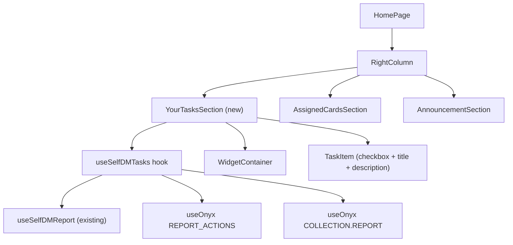

# Your Tasks Home Widget

## Architecture

The widget follows the same pattern as `TimeSensitiveSection` and `AssignedCardsSection`:

- A custom hook (`useSelfDMTasks`) to fetch and filter task-related report actions from the user's self-DM report
- A section component (`YourTasksSection`) that renders inside a `WidgetContainer` and returns `null` when there are no tasks
- A simple `TaskItem` component with: clickable checkbox, title, and description

## Data Flow

1. `useSelfDMTasks` hook:

- Uses existing `useSelfDMReport` hook to get the self-DM report ID
- Subscribes to `ONYXKEYS.COLLECTION.REPORT_ACTIONS` for that report's actions
- Filters actions using `isCreatedTaskReportAction` from ReportActionsUtils
- For each task action, resolves the full task report from `ONYXKEYS.COLLECTION.REPORT` using `originalMessage.taskReportID`
- Filters out cancelled/deleted task reports
- Returns task reports limited to 5
- Returns a `hasAnyTasks` flag for visibility gating

1. `TaskItem` component:

- Clickable checkbox that toggles task completion (completeTask / reopenTask)
- Title from the task report's `reportName`
- Description from the task report's `description` field

1. `YourTasksSection` component:

- Returns `null` if `hasAnyTasks` is false
- Wraps content in `WidgetContainer` with title "Your tasks"
- Renders each task using `TaskItem`

1. Placement in `HomePage.tsx`: First child of the right column, before `AssignedCardsSection`

## Key Files

- **Existing test utilities**: [tests/utils/collections/reports.ts](tests/utils/collections/reports.ts) -- has `createSelfDM`, `createRegularTaskReport`
- **Existing test utilities**: [tests/utils/collections/reportActions.ts](tests/utils/collections/reportActions.ts) -- has `createRandomReportAction`
- **Widget pattern reference**: [src/pages/home/TimeSensitiveSection/index.tsx](src/pages/home/TimeSensitiveSection/index.tsx)
- **Task utils reference**: [src/components/ReportActionItem/TaskPreview.tsx](src/components/ReportActionItem/TaskPreview.tsx)
- **Hook test pattern**: [tests/unit/hooks/useTimeSensitiveCards.test.ts](tests/unit/hooks/useTimeSensitiveCards.test.ts)

## Phase 1: Unit Tests Only

Write tests for the `useSelfDMTasks` hook at `tests/unit/hooks/useSelfDMTasks.test.ts`.
**This step creates only the test file.** The hook does not exist yet — tests will fail until Phase 2.

Test cases:

- **Empty state**: Returns empty tasks array and `hasAnyTasks: false` when no tasks exist in self-DM
- **Task detection**: Returns tasks from self-DM report actions that are `isCreatedTaskReportAction`
- **Both open and completed**: Includes both open tasks (stateNum=OPEN) and completed tasks (stateNum=APPROVED)
- **Non-task actions ignored**: Filters out regular ADD_COMMENT actions that don't have `taskReportID`
- **Limit of 5**: Returns at most 5 tasks and signals when there are more
- **Task data resolution**: Each returned task includes the associated task report data (title, status)

Test setup pattern (following `useTimeSensitiveCards.test.ts`):

- Use real Onyx with `Onyx.init`, `Onyx.clear`, `waitForBatchedUpdates`
- Use `createSelfDM` for the self-DM report
- Create task report actions with `taskReportID` in `originalMessage`
- Use `createRegularTaskReport` or build task reports manually with appropriate fields

## Phase 2: Hook Implementation

Create `src/pages/home/YourTasksSection/hooks/useSelfDMTasks.ts` to make the Phase 1 tests pass.

## Phase 3: UI Components

- Create `src/pages/home/YourTasksSection/TaskItem.tsx` (simple: checkbox, title, description)
- Create `src/pages/home/YourTasksSection/index.tsx`

## Phase 4: Integration

- Update HomePage.tsx to add `YourTasksSection` as first child in the right column
- Add translation key `homePage.yourTasks` in locale files

