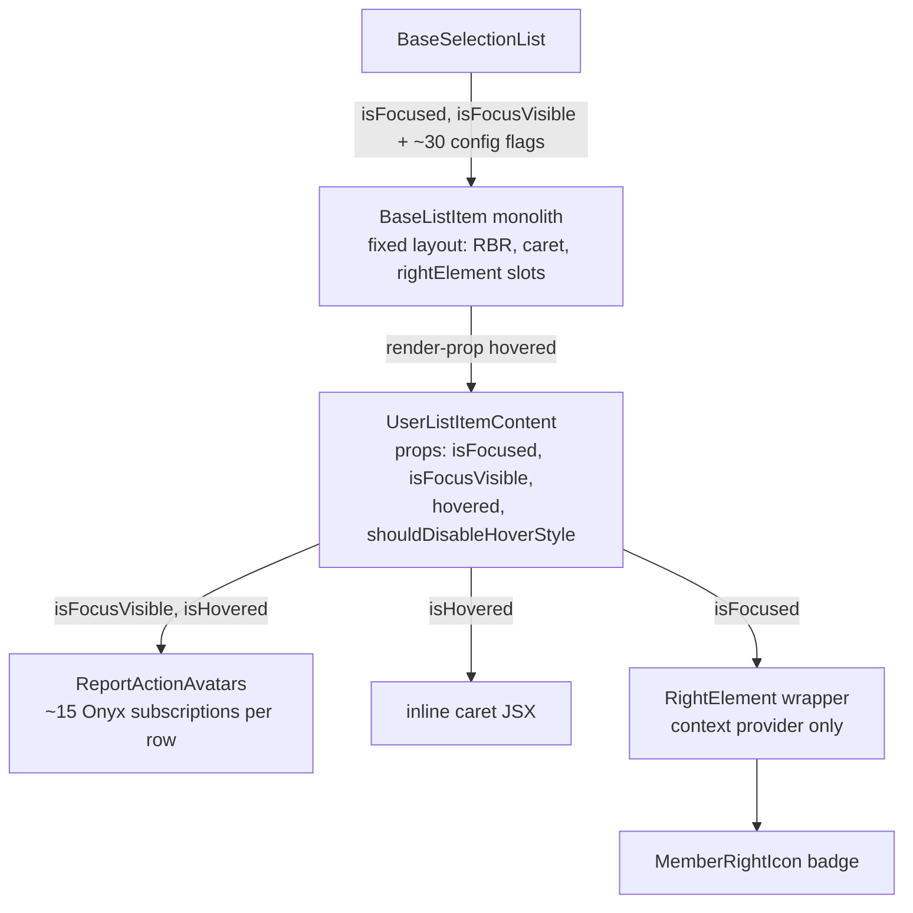
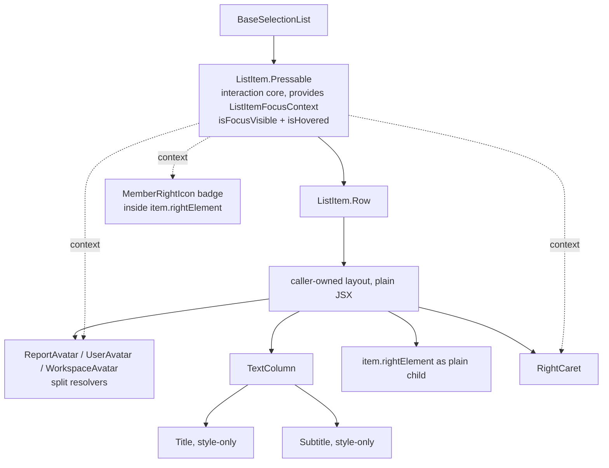

# SelectionList ListItem decomposition — PR plan

Companion to `SELECTION_LIST_LIST_ITEM_PROPOSAL.md`. The POC (working tree; evidence in `contributingGuides/LIST_ITEM_DECOMPOSITION_PROPOSAL.md`) built everything at once. This plan cuts it into vertical slices.

## Rules

1. Every PR fully migrates at least one row variant: interaction core, wrappers, content. No half-states where a row uses new primitives inside the legacy pressable.
2. Primitives land in the PR that first needs them.
3. The legacy `BaseListItem` path serves unmigrated rows untouched until the final sweep. No big-bang core swap.
4. Independent cleanups (`useListItemHighlight` extraction, `TableListItem` deletion) ride PR 1.

## Primitive needs per variant

| Variant | Needs |
| --- | --- |
| `SearchQueryListItem` | `Pressable`, `Row`, `Title`, `Subtitle`, `RBRIndicator` |
| `BaseSelectListItem` (→ `SingleSelectListItem`, ~59% of call sites), `TravelDomainListItem`, `CardListItem` | + `SelectableListItem` adapter (+ existing `ListSelectionButton`), `TextColumn` |
| `MultiSelectListItem`, `UserSelectionListItem` | + `CompactAvatar` |
| `UserListItemContent` (backs `UserListItem`, `BareUserListItem`) | + `ReportAvatar`/`UserAvatar`/`WorkspaceAvatar`, `RightCaret` |
| `InviteMemberListItem` | no new primitives |

## API principles

- **Style-prop-only primitives.** `Title`, `Subtitle`, `TextColumn` bake default styles in and expose a single `style` override. No `isBold`/`isMultiline`/`hasSubtitle`/`isMuted`/`paddingLeft`/`maxWidth`/`variant` props. Callers pass deviations as styles. Title focus styling is already gone — `sidebarLinkActiveText` was byte-identical to `sidebarLinkText`, so the toggle was a no-op (and had drifted: `isFocusVisible` in `BaseSelectListItem` vs `isFocused` in `UserListItemContent`). Deleted ahead of the train in `d45764d97c9`, already in `main`; no PR here re-does it.
- **Text transforms at call sites.** No `shouldRemoveSMSDomain` prop; callers pass `Str.removeSMSDomain(item.text ?? '')`.
- **Avatar resolution split by input.** `ReportAvatar` (reportID → `ReportActionAvatars`), `UserAvatar` (accountID → personal-details context, zero `useOnyx` subscriptions vs ~15), `WorkspaceAvatar` (policyID → one `usePolicy` read). `CompactAvatar` is presentational: renders a pre-resolved `item.icons` entry via `Avatar` (`Icon` cannot render URL/letter-avatar sources).
- **Focus/hover via context.** `ListItemFocusContext` carries `isFocusVisible` and `isHovered`; `ListItem.Pressable` provides it. No prop threading. No `RightElement` primitive: `item.rightElement` renders as a plain child.
- **Selection button is one component.** `ListSelectionButton` with required `role` (checkbox/radio); shape and a11y derive from role.
- **No speculative type exports.** Props types stay file-local; public surface is the `ListItem` namespace plus `useListItemHighlight`.

## Before / after

## PR train

### PR 1 — Core + `SearchQueryListItem`

- **Migrates:** `SearchQueryListItem` — the only variant that reaches a full end state without the `SelectableListItem` adapter, and the one the POC actually proved on `Pressable`.
- **Components needed:** `ListItem.Pressable`, `Row`, `Title`, `Subtitle`, `RBRIndicator`, `ListItemFocusContext` + `useListItemFocus`.
- **Implementation details:**
  - `Pressable` = `OfflineWithFeedback` + `PressableWithFeedback`, press/hover/focus/a11y, zero layout; a11y extracted to `utils/getListItemAccessibilityProps.ts`. Row sits on it directly; icon stays plain `Icon`; right element renders as plain child; non-bold title via `style={[styles.fontWeightNormal, styles.textSupporting]}`. No selection button — `SearchQueryListItem` has none; that waits for PR 2's adapter.
  - Widen `ListItemFocusContext` to `{isFocused?, isFocusVisible?, isHovered?}` and switch `MemberRightIcon` (`MemberRightIcon.tsx:23`) to `isFocusVisible ?? isFocused`; legacy `{isFocused}` providers coexist until PR 4/PR 5.
  - Side quests: extract `useListItemHighlight` and convert `TaskListItem`, `ChatListItem` ([highlight-hook rollout](#highlight-hook-rollout)); delete `TableListItem` (dead code, referenced only by `types.ts`).

### PR 2 — `SelectableListItem` adapter + `BaseSelectListItem` + `TravelDomainListItem` + `CardListItem`

- **Migrates:** `BaseSelectListItem` / `SingleSelectListItem` (~59% of `ListItem=` call sites), `TravelDomainListItem`, `CardListItem`. `SingleSelectWithAvatarListItem` comes along transitively — it wraps `SingleSelectListItem` and needs no work of its own.
- **Components needed:** `SelectableListItem` adapter (checkbox/radio via `ListSelectionButton`, role derived from `canSelectMultiple`, composed on `ListItem.Pressable`); `TextColumn` (style-only, no `variant`) — `CardListItem` is its first consumer (Rule 2). `SearchQueryListItem` keeps its hand-rolled compact column: `TextColumn` bakes `optionRow` (min-height + vertical padding) that query rows deliberately omit.
- **Deletes:** `components/ListCheckbox.tsx`, `components/ListRadioButton.tsx` — pure role-fixing wrappers; callers pass `role={CONST.ROLE.CHECKBOX}` / `{CONST.ROLE.RADIO}` on `ListSelectionButton` directly. Includes the one consumer outside `SelectionList/`, [`NewChatPage/index.tsx:281`](src/pages/NewChatPage/index.tsx#L281) — the train's only page-file edit.
- **Implementation details:**
  - `TravelDomainListItem` rides here rather than PR 1: it renders `<SelectableListItem>`, and a title-only swap would be the half-state Rule 1 forbids.
  - Multiline: `styles.preWrap` + inline `{paddingLeft}`; muted: `styles.colorMuted`; subtitle `maxWidth` via `style`.
  - **Not fully mechanical:** `ListRadioButton` defaults `tabIndex={tabIndex ?? -1}`; `ListSelectionButton` forwards `tabIndex` undefined. Carry the default (by role inside `ListSelectionButton`, or explicit `tabIndex={-1}` per radio call site) or every radio row re-enters the tab order.
  - Later variants (`UserListItemContent`, `InviteMemberListItem`) adopt `TextColumn` in their own PRs — no retrofit pass.

### PR 3 — `CompactAvatar` + multi-select rows

- **Migrates:** `MultiSelectListItem`, `UserSelectionListItem`.
- **Components needed:** `CompactAvatar`.
- **Implementation details:**
  - Renders pre-resolved `item.icons` entry; `AVATAR_SIZE.X_SMALL`, mention-suggestion container styles.

### PR 4 — Avatar resolvers + `UserListItem` family

- **Migrates:** `UserListItemContent`, `UserListItem`, `BareUserListItem`.
- **Components needed:** `ReportAvatar`, `UserAvatar`, `WorkspaceAvatar`, `RightCaret`.
- **Implementation details:**
  - Callers branch on report/account/policy; account and policy paths skip the report-action pipeline.
  - `item.rightElement` renders as plain child; no `RightElement` primitive.
  - `UserListItemContent` drops `isFocused`, `isFocusVisible`, `hovered`, `shouldDisableHoverStyle` props; hosts pass it as plain child instead of render-prop.
  - Drift fixes: avatar focus border via context `isFocusVisible`; caret hover fill via `getButtonState`, gated by `shouldDisableHoverStyle` through context; `MemberRightIcon` badge on visual focus.
  - Behavior changes to document: item with both `accountID` and `policyID` renders plain user avatar (was policy+user subscript); `WorkspaceAvatar` skips announce/admins-room icon lookup.

### PR 5 — `InviteMemberListItem`

- **Migrates:** `InviteMemberListItem`.
- **Components needed:** none new.
- **Implementation details:**
  - Avatar branch: user / report / text-only fallback (`UserAvatar` with `CONST.DEFAULT_NUMBER_ID`).
  - Secondary-login footer and product-training tooltips as conditional JSX.
  - POC's transitional `showSelectionButton` prop on `SelectableListItem` is skipped.

### PR 6 — Sweep and flag deletion

- **Migrates:** the full residue, enumerated — `SpendCategorySelectorListItem`, `SpendRuleListItem`, `SplitListItem` (the three remaining direct `BaseListItem` wrappers). Nothing else is left: every other `ValidListItem` entry lands in PRs 1-5 or is covered transitively.
- **Components needed:** none new.
- **Implementation details:**
  - `SearchRouterItem` needs no migration of its own: it is a dispatcher (`SearchAutocompleteList.tsx:144`) that renders `UserListItem` or `SearchQueryListItem`, both migrated by then (PR 4, PR 1).
  - `SplitListItem` migrates its pressable/layout like any variant; only its highlight stays on raw `useAnimatedHighlightStyle` (see [highlight-hook rollout](#highlight-hook-rollout) exclusions — the two are independent).
  - If the three variants make the diff unwieldy, split this into one PR per variant plus a final flags-only PR — but the *set* above is closed either way.
  - `BaseListItem` end state decided here: thin adapter over `ListItem.Pressable` or deletion.
  - Each flag dies with its last consumer: `shouldDisplayRBR`, prop-level `shouldShowRightCaret` (item-level flag from `useConfirmationSections.ts` stays), `rightHandSideComponent`, `FooterComponent`, `wrapperStyle`/`testID` forwarding.
  - `ListItem/types.ts` reduction; drop render-prop compat.

### PR 7 — Search-row highlight conversions

- **Migrates:** nothing — highlight wiring only.
- **Converts:** `TransactionListItemWide`, `TransactionListItemNarrow`, `TransactionGroupListItem`, `ExpenseReportListItem`.
- **Components needed:** three new `useListItemHighlight` params.
- **Implementation details:**
  - These four are Search rows with no relation to the `SelectionList` variants in PRs 2-6, so they get their own PR rather than riding one as an unrelated diff. It depends on PR 1 alone and can land any time after it.
  - Wide and Narrow must move together: two halves of one component behind a screen-width switch, so splitting them ships a `TransactionListItem` whose branches disagree on where the highlight comes from.
  - Details and per-row calls in [highlight-hook rollout](#highlight-hook-rollout).

## Highlight-hook rollout

Six rows convert to `useListItemHighlight`. `TaskListItem` and `ChatListItem` ride PR 1 because they consume the pressable bundle, so the hook's main job is exercised on landing. The four Search rows go together in PR 7.

| PR | Row | Call | New hook params |
| --- | --- | --- | --- |
| PR 1 | `TaskListItem` | `variant: 'searchTable'` + pressable bundle | — |
| PR 1 | `ChatListItem` | `default` variant + pressable bundle | — |
| PR 7 | `TransactionListItemWide` | `animatedHighlightStyle` only, `shouldApplyOtherStyles: false` | all three |
| PR 7 | `TransactionListItemNarrow` | `animatedHighlightStyle` only, `shouldApplyOtherStyles: true` | — |
| PR 7 | `TransactionGroupListItem` | `animatedHighlightStyle` only, `shouldApplyOtherStyles: false` | — |
| PR 7 | `ExpenseReportListItem` | `variant: 'searchTable'` already supplies `!isLargeScreenWidth` | — |

All three params land in PR 7, since PR 1's two rows need none of them (Rule 2). That only `TransactionListItemWide` forces them and the other three then reuse them is the check that they were cut along the right lines:

- `shouldTrackSelectedBackground` — the resting background the highlight settles onto follows selection (`activeComponentBG`). Four rows paint a selected background and must animate back to it. `TaskListItem`/`ChatListItem` rest on `highlightBG` today and stay that way, so the flag is opt-in rather than derived from `isSelected`. Worth a separate look: those two paint `activeComponentBG` via the `searchTable` recipe while resting the highlight on `highlightBG`, which looks like a latent bug — deliberately not "fixed" silently inside a refactor PR.
- `borderRadius` — override for rows using `0`. Inert wherever `shouldApplyOtherStyles` is `false`, since `useAnimatedHighlightStyle` only applies radius inside that branch.
- `shouldApplyOtherStyles` — override for rows whose choice is fixed rather than screen-width-derived.

Rows owning their own pressable layout take `animatedHighlightStyle` alone and ignore the pressable bundle; the hook documents this.

PR 7 keeps `TransactionListItemNarrow`'s `shouldAnimateInHighlight` latch (suppressing the opaque focus background so a post-split row actually shows its highlight) at the call site — row behavior, not highlight config. `ExpenseReportListItem` was previously listed as permanently excluded; that exclusion was size-based (25.7K file), not semantic, and the hook call is seven lines.

Permanently excluded:

- `SplitListItem` — different animation, not a config delta. Triggers on `splitItem.isSelected` rather than `item.shouldAnimateInHighlight`, so the highlight is a persistent selected-state indicator, not a transient one. Also needs `skipInitialFade`, `itemEnterDelay`, and a third border radius (`variables.componentBorderRadius`). Absorbing it would leave the hook a passthrough of `useAnimatedHighlightStyle`. It is a split *editor* row (inputs, percentage drafts, autofocus), not a selectable list row.
- `GroupHeader`, `GroupChildrenContainer` — not rows. A header and an `Animated.View` container, neither with a pressable, so they want only `animatedHighlightStyle` and gain nothing from the bundle. These are what the old "non-row consumers out of scope" clause meant; naming them stops them reading as oversights.

Out of scope entirely (not `SelectionList`/Search rows): `TransactionPreviewContent`, `HighlightableMenuItem`, `HighlightableMenuItemWithTopDescription`, `Search/index`, `Table/TableRow`, `MoneyRequestReportTransactionItem`, `UnreportedExpenseListItem`, `MergeTransactionItem`.

## Follow-up: prop-count reduction

47 boolean declarations in `ListItem/types.ts` = 33 unique names; 14 re-declarations die when layers collapse. The train deletes pure config flags (`shouldDisplayRBR`, prop-level `shouldShowRightCaret`, hover/focus threading, doubled `isMultilineSupported`/`isAlternateTextMultilineSupported` channel): ~28 unique names remain, all item data (`isSelected`, `isDisabled`, `isBold`). Non-boolean surface (`rightHandSideComponent`, `FooterComponent`, `wrapperStyle`, `testID`, `selectionButtonPosition`) shrinks separately.

Call-site wave, after the train completes:

### PR 8 — Flip `shouldSingleExecuteRowSelect` default to `true`

Current default is `false` in both `BaseSelectionList` (`:96`) and `BaseSelectionListWithSections` (`:81`). Target is `true`, so the bare opt-ins disappear and the opt-outs become explicit.

Two universes are affected, not one:

| Universe | Sites | bare `shouldSingleExecuteRowSelect` → delete | rely on default → add `={false}` |
| --- | --- | --- | --- |
| Direct: writes `ListItem=` | 152 | 84 | 68 |
| Indirect: renders `<SelectionScreen>` | 89 | 43 | 46 |
| **Total** | **241** | **127** | **114** |

- Direct count is 155 files carrying `ListItem=` (160 occurrences) minus 3 plumbing files that declare or forward rather than call: `BaseSelectionList`, `BaseSelectionListWithSections`, `SelectionScreen`.
- `SelectionScreen` is the missing half. It defaults `ListItem` to `SingleSelectListItem` (`:130`), so its consumers never write `ListItem=` and fall outside the direct count. It declares `shouldSingleExecuteRowSelect?: boolean` with no default (`:97`, `:144`) and forwards it verbatim (`:191`), so `undefined` falls straight through to the flipped `BaseSelectionList` default — **its 46 non-passing consumers change behavior with zero diff on their own files.** They are the real risk, not the 68 direct opt-outs, which at least get an explicit `={false}` in review.

Split into PR 8a (direct, 152 files) and PR 8b (`SelectionScreen`, 89 files) — 241 touched files in one PR is not reviewable, and the two halves fail differently.

### PR 9 — Tooltip naming dedup

`BaseSelectionList` and `BaseSelectionListWithSections` declare `shouldShowTooltips = true`, feed down as `showTooltip`. 7 of 155 call sites mention either name. Rename ListItem-level `showTooltip` → `shouldShowTooltips`, make optional. Rename only.

### PR 10 — `canSelectMultiple` — re-scope or drop

Variant↔mode mapping is many-to-many (26 call sites across 8 variants; 32 bare, 3 `={false}`, 3 forwards, 2 dynamic). Static preset field cannot express it. Drop unless a better cut is found.

### PR 11 — Long-tail flag deletion

`shouldIgnoreFocus` (3 call sites), `shouldUseUserSkeletonView` (1): replace with local presets or delete. Corrections: `shouldDebounceRowSelect` does not exist in `src`; `isAlternateTextMultilineSupported` is derived by `BaseSelectionList` from `alternateNumberOfSupportedLines`, dies with that channel.

Each PR independently revertible. PRs 1-7 leave the preset call sites untouched, with one deliberate exception: PR 2 converts `NewChatPage`'s `ListCheckbox` usage. The call-site wave (PRs 8-11) exists precisely to change them.
