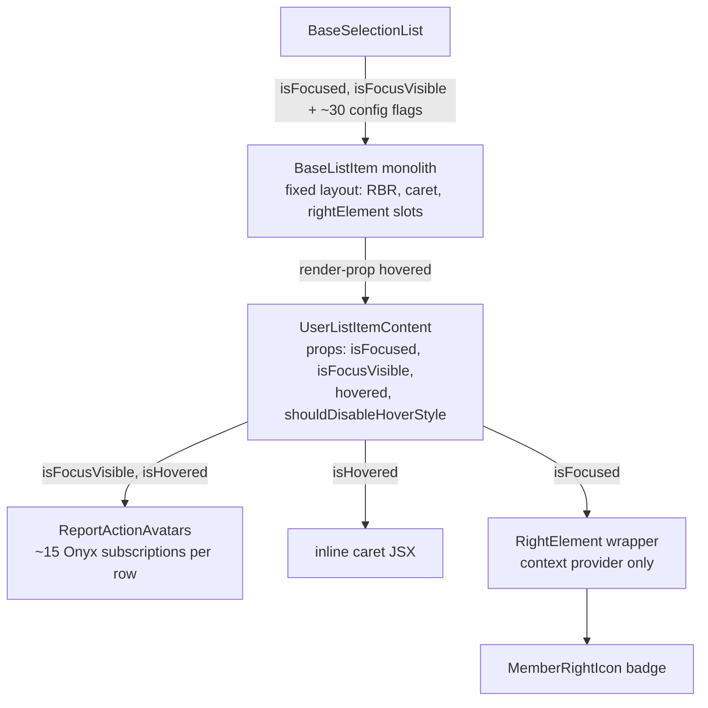
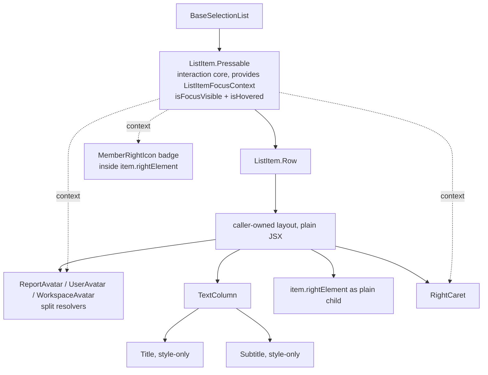

# SelectionList ListItem decomposition — PR plan

Companion to `SELECTION_LIST_LIST_ITEM_PROPOSAL.md`. The POC (working tree; evidence in `contributingGuides/LIST_ITEM_DECOMPOSITION_PROPOSAL.md`) built everything at once. This plan cuts it into vertical slices.

## Rules

1. Every PR fully migrates at least one row variant: interaction core, wrappers, content. No half-states where a row uses new primitives inside the legacy pressable.
2. Primitives land in the PR that first needs them.
3. Call sites migrate with their rows, never in bulk. Applies to `useAnimatedHighlightStyle` → `useListItemHighlight` conversions, wrapper removals, flag deletions.
4. The legacy `BaseListItem` path serves unmigrated rows untouched until the final sweep. No big-bang core swap.
5. Independent cleanups (`useListItemHighlight` extraction, `TableListItem` deletion) ride PR 1.

## Primitive needs per variant

| Variant | Needs |
| --- | --- |
| `TravelDomainListItem` | `Pressable`, `Row`, `Title` (+ existing `ListSelectionButton` as plain JSX) |
| `SearchQueryListItem` | + `Subtitle`, `RBRIndicator` |
| `BaseSelectListItem` (→ `SingleSelectListItem`, ~59% of call sites) | + `SelectableListItem` adapter |
| `CardListItem` | + `TextColumn` |
| `MultiSelectListItem`, `UserSelectionListItem` | + `CompactAvatar` |
| `UserListItemContent` (backs `UserListItem`, `BareUserListItem`) | + `ReportAvatar`/`UserAvatar`/`WorkspaceAvatar`, `RightCaret` |
| `InviteMemberListItem` | no new primitives |

## API principles

- **Style-prop-only primitives.** `Title`, `Subtitle`, `TextColumn` bake default styles in and expose a single `style` override. No `isBold`/`isMultiline`/`hasSubtitle`/`isMuted`/`paddingLeft`/`maxWidth`/`variant` props. Callers pass deviations as styles. Title focus styling removed entirely: `sidebarLinkText` and `sidebarLinkActiveText` are identical style objects, the toggle was a no-op.
- **Text transforms at call sites.** No `shouldRemoveSMSDomain` prop; callers pass `Str.removeSMSDomain(item.text ?? '')`.
- **Avatar resolution split by input.** `ReportAvatar` (reportID → `ReportActionAvatars`), `UserAvatar` (accountID → personal-details context, zero `useOnyx` subscriptions vs ~15), `WorkspaceAvatar` (policyID → one `usePolicy` read). `CompactAvatar` is presentational: renders a pre-resolved `item.icons` entry via `Avatar` (`Icon` cannot render URL/letter-avatar sources).
- **Focus/hover via context.** `ListItemFocusContext` carries `isFocusVisible` and `isHovered`; `ListItem.Pressable` provides it. No prop threading. No `RightElement` primitive: `item.rightElement` renders as a plain child.
- **Selection button is one component.** `ListSelectionButton` with required `role` (checkbox/radio); shape and a11y derive from role.
- **No speculative type exports.** Props types stay file-local; public surface is the `ListItem` namespace plus `useListItemHighlight`.

## Before / after

## PR train

### PR 1 — Core + `TravelDomainListItem`

- **Migrates:** `TravelDomainListItem`.
- **Components needed:** `ListItem.Pressable`, `Row`, `Title`, `ListItemFocusContext` + `useListItemFocus`.
- **Implementation details:**
  - `Pressable`: `OfflineWithFeedback` + `PressableWithFeedback`, press/hover/focus/a11y, zero layout, provides `ListItemFocusContext`. A11y computation extracted to `utils/getListItemAccessibilityProps.ts`.
  - Checkbox as plain JSX: `ListSelectionButton` with `role={CONST.ROLE.CHECKBOX}`. No selection adapter yet.
  - Non-bold title via `style={[styles.fontWeightNormal, styles.textSupporting]}`.
  - Side quest: `useListItemHighlight` (`default`/`searchTable` variants); convert `TaskListItem`, `ChatListItem` only. Other `useAnimatedHighlightStyle` row consumers convert in their own row's PR. Permanently excluded: `SplitListItem`, `ExpenseReportListItem`; non-row consumers out of scope.
  - Side quest: delete `TableListItem` (dead code; referenced only by `types.ts`: `ValidListItem` union, `TableListItemProps` alias/export).

### PR 2 — `SearchQueryListItem`

- **Migrates:** `SearchQueryListItem`.
- **Components needed:** `Subtitle`, `RBRIndicator`.
- **Implementation details:**
  - Icon stays plain `Icon`; right element renders as plain child.
  - Row leaves the legacy wrapper, sits on `ListItem.Pressable` directly.

### PR 3 — `SelectableListItem` adapter + `BaseSelectListItem`

- **Migrates:** `BaseSelectListItem` / `SingleSelectListItem` (~59% of `ListItem=` call sites).
- **Components needed:** `SelectableListItem` adapter (checkbox/radio via `ListSelectionButton`, role derived from `canSelectMultiple`, composed on `ListItem.Pressable`).
- **Implementation details:**
  - Multiline: `styles.preWrap` + inline `{paddingLeft}`; muted: `styles.colorMuted`; subtitle `maxWidth` via `style`.
  - Title focus-toggle removal (identical style objects); screenshot as no-visual-change evidence.

### PR 4 — `TextColumn` + `CardListItem`

- **Migrates:** `CardListItem`.
- **Components needed:** `TextColumn` (style-only, no `variant`).
- **Implementation details:**
  - Earlier variants adopt `TextColumn` where they hand-roll the column.

### PR 5 — `CompactAvatar` + multi-select rows

- **Migrates:** `MultiSelectListItem`, `UserSelectionListItem`.
- **Components needed:** `CompactAvatar`.
- **Implementation details:**
  - Renders pre-resolved `item.icons` entry; `AVATAR_SIZE.X_SMALL`, mention-suggestion container styles.

### PR 6 — Avatar resolvers + `UserListItem` family

- **Migrates:** `UserListItemContent`, `UserListItem`, `BareUserListItem`.
- **Components needed:** `ReportAvatar`, `UserAvatar`, `WorkspaceAvatar`, `RightCaret`.
- **Implementation details:**
  - Callers branch on report/account/policy; account and policy paths skip the report-action pipeline.
  - `item.rightElement` renders as plain child; no `RightElement` primitive.
  - `UserListItemContent` drops `isFocused`, `isFocusVisible`, `hovered`, `shouldDisableHoverStyle` props; hosts pass it as plain child instead of render-prop.
  - Drift fixes: avatar focus border via context `isFocusVisible`; caret hover fill via `getButtonState`, gated by `shouldDisableHoverStyle` through context; `MemberRightIcon` badge on visual focus.
  - Behavior changes to document: item with both `accountID` and `policyID` renders plain user avatar (was policy+user subscript); `WorkspaceAvatar` skips announce/admins-room icon lookup.
  - Keyboard-nav screenshots: member list and invite flow, web, Tab/Arrow keys.

### PR 7 — `InviteMemberListItem`

- **Migrates:** `InviteMemberListItem`.
- **Components needed:** none new.
- **Implementation details:**
  - Avatar branch: user / report / text-only fallback (`UserAvatar` with `CONST.DEFAULT_NUMBER_ID`).
  - Secondary-login footer and product-training tooltips as conditional JSX.
  - POC's transitional `showSelectionButton` prop on `SelectableListItem` is skipped.

### PR 8 — Sweep and flag deletion

- **Migrates:** remaining variants; one variant or small cluster per PR.
- **Components needed:** none new.
- **Implementation details:**
  - `BaseListItem` end state decided here: thin adapter over `ListItem.Pressable` or deletion.
  - Each flag dies with its last consumer: `shouldDisplayRBR`, prop-level `shouldShowRightCaret` (item-level flag from `useConfirmationSections.ts` stays), `rightHandSideComponent`, `FooterComponent`, `wrapperStyle`/`testID` forwarding.
  - `ListItem/types.ts` reduction; drop render-prop compat.

## Follow-up: prop-count reduction

47 boolean declarations in `ListItem/types.ts` = 33 unique names; 14 re-declarations die when layers collapse. The train deletes pure config flags (`shouldDisplayRBR`, prop-level `shouldShowRightCaret`, hover/focus threading, doubled `isMultilineSupported`/`isAlternateTextMultilineSupported` channel): ~28 unique names remain, all item data (`isSelected`, `isDisabled`, `isBold`). Non-boolean surface (`rightHandSideComponent`, `FooterComponent`, `wrapperStyle`, `testID`, `selectionButtonPosition`) shrinks separately.

Call-site wave, after the train completes:

### PR 9 — Flip `shouldSingleExecuteRowSelect` default

Default `false`. Of 155 call sites: 87 pass it (84 bare `true`), 68 rely on the default. Flip requires deleting 84 bare usages and adding `={false}` to 68 opt-outs. Re-verify the 68 before committing.

### PR 10 — Tooltip naming dedup

`BaseSelectionList` and `BaseSelectionListWithSections` declare `shouldShowTooltips = true`, feed down as `showTooltip`. 7 of 155 call sites mention either name. Rename ListItem-level `showTooltip` → `shouldShowTooltips`, make optional. Rename only.

### PR 11 — `canSelectMultiple` — re-scope or drop

Variant↔mode mapping is many-to-many (26 call sites across 8 variants; 32 bare, 3 `={false}`, 3 forwards, 2 dynamic). Static preset field cannot express it. Drop unless a better cut is found.

### PR 12 — Long-tail flag deletion

`shouldIgnoreFocus` (3 call sites), `shouldUseUserSkeletonView` (1): replace with local presets or delete. Corrections: `shouldDebounceRowSelect` does not exist in `src`; `isAlternateTextMultilineSupported` is derived by `BaseSelectionList` from `alternateNumberOfSupportedLines`, dies with that channel.

## Verification gate (every PR)

1. `npm run typecheck-tsgo` (+ CI `npm run typecheck`), `npm run lint-changed`.
2. Unit tests: `BaseSelectionListTest`, `BaseSelectionListSectionsTest`, `BaseSelectionListDataDetailsTest`, `UserSelectionListItemTest`, `TransactionGroupListItemTest`.
3. `npm run react-compiler-compliance-check check-changed` — both compilers, no memoization divergence.
4. Reassure `tests/perf-test/SelectionList.perf-test.tsx` before/after — mandatory on PR 1, PR 3, PR 6; spot-check elsewhere. PR 1 additionally: element-tree/`View`-count diff on the migrated row; hover re-render probe (only context consumers re-render).
5. Screenshots on drift-fix PRs (PR 3, PR 6).

Each PR independently revertible. No PR changes the 155 preset call sites.
